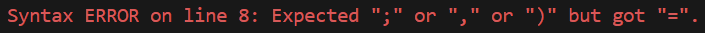

# Analizador léxico y sintáctico del lenguaje Falak

<div align = "center">
    <div>
        Marco Antonio Gardida Cortés - A01423221
    </div>
    <div>
        Miguel Jiménez Padilla - A01423189
    </div>
</div>
<br/>

## Requisitos Previos

Para utilizar este analizador, debes tener instalado [Bun](https://bun.sh/docs/installation). Asegúrate de que Bun,  que actúa tanto como *runtime* como *package manager*, esté correctamente instalado en tu sistema antes de continuar.

## Instalación y/o actualización de dependencias

Antes de ejecutar el analizador, puede que necesites instalar ciertas dependencias. Abre tu terminal y navega hasta el directorio donde se encuentra el proyecto. Una vez allí, ejecuta el siguiente comando:

```bash
bun install
```
Posteriormente, escribe el siguiente comando para ejecutar el programa:

```bash
bun run index.ts
```


## Uso del analizador

Una vez ejecutado el programa, aparecerá la siguiente leyenda en la terminal:

```bash
Please drag and drop the file into this window and press Enter:
```

1. Arrastra o escribe la ruta del archivo .falak para ser leído

*Nota: se recomienda utilizar la terminal de VSCode para escribir o arrastrar el archivo y proceder con el programa. Esto se debe a que la librería utilizada para lectura de archivos, readFileSync, en ocasiones no funciona correctamente en terminales nativas de SO como Windows o Mac.*

2. Después de arrastrar el archivo, presiona **ENTER** para comenzar el análisis.

## Resultados y etructura de visualización

El analizador determinará si ha podido procesar correctamente el archivo .falak. De ser exitoso, desplegará  una lista de tokens obtenida del analizador léxico, así como el parseo utilizando SLR y el árbol sintáctico resultante. El programa finalizará con el siguiente mensaje de éxito:


El sistema generará un archivo `output.txt` que contiene el árbol sintáctico resultante.

Si el análisis falla, el analizador mostrará un mensaje de error en la terminal, explicando el problema, como por ejemplo, esperar un tipo de dato y recibir otro.


